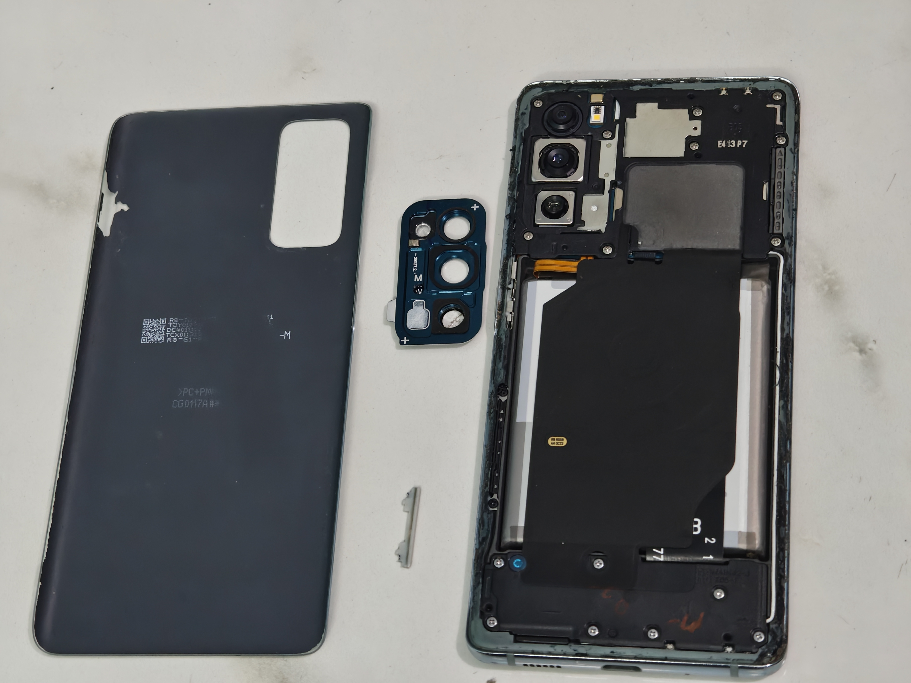

# FoggyPhone

This is something that I wanted to from a long time to my phone. This summer seemed the perfect time to do that.

But what is it?
I watched  and wanted to do that. Samsung S20Fe seems to have a problem of overheating that's why the loose backpanel is a common issue.

So here I'm doing this.

Here is the removed backpanel image of my phone.
.

# BOM Table

|Name|Use|Quantity|Distributer|
|-----|---|-------|-----------|
|Battery|Old one Gives 2-3 hours|1|MacFactory|
|Gasket|To seal modded Backpanel|1|MacFactory|
|Camera Glass|It's Broken in my phone|1|MacFactory|
